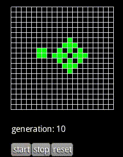

# LifeGame

 
 
##Description
A simple game of life written with Kotlin and libGDX.
##Download
Not released yet. After finish v0.3, first one will be released.  
libGDX is a cross platform game library.  
However, this game only targets desktop(Windows, Mac, Linux) now.
If you want to try the under development version, use `git clone https://github.com/mmorihiro/LifeGame.git`  
Then, move to the project root and run `./gradlew run`
##How to play
Very simple and easy.  

* You can change life or death by clicking the field.
* This game has just 3 buttons. Press and see how it works.
##Contributing
Feel free to submit issues or send pull requests.
